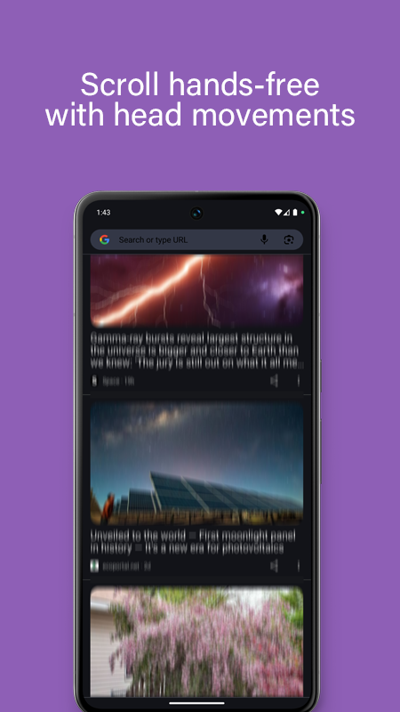
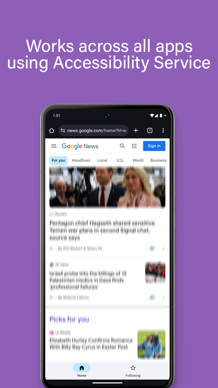

# MotionScroll

Scroll through your Android screen using simple head movements. Built with Jetpack Compose and ML Kit.

MotionScroll is an Android application that leverages the front camera and accessibility features to enable hands-free scrolling based on head tilt detection.

## Screenshots

Here's a glimpse of MotionScroll in action:

## Features

*   **Head-Controlled Scrolling:** Navigate content vertically using up/down head tilts.
*   **System-Wide Control:** Works in most scrollable apps via Android's Accessibility Service.
*   **Multiple Scroll Modes:**
    *   **Continuous:** Smooth scrolling while head is tilted.
    *   **Skip:** Jumps a set distance (adjustable) with a 1s cooldown.
    *   **Delay:** Jumps a set distance (adjustable) with a custom cooldown (seconds).
*   **Adjustable Skip Distance:** Fine-tune scroll amount for Skip/Delay modes via a slider.
*   **Camera Toggle:** Easily enable/disable head tracking.
*   **Theme Support:** Adapts to system Light/Dark themes.
*   **Privacy Focused:** Face detection processing happens on-device.

## Download

*   **Version:** 1.0.0
*   **Updated at:** 2025-04-21
*   **Min. Android version:** (Check your `build.gradle.kts` - likely API 24+ due to CameraX/MLKit)
*   **Download:** [APK](https://github.com/ayxse/MotionScroll/releases/tag/v1.0.0)

## Tech Stack

*   **Language:** Kotlin
*   **User Interface:** Jetpack Compose
*   **Concurrency:** Coroutines
*   **Camera:** CameraX
*   **Machine Learning:** Google ML Kit (Face Detection)
*   **Core:** Android Accessibility Service, Android SDK

## Building

1.  Ensure you have the latest stable version of Android Studio installed.
2.  Clone the repository: `git clone https://github.com/your-username/MotionScroll.git`
3.  Open the project in Android Studio.
4.  Let Gradle sync the project dependencies.
5.  Run the `app` configuration on an emulator or physical device.

## License

Copyright 2025 Cristian

Licensed under the Apache License, Version 2.0 (the "License");
you may not use this file except in compliance with the License.
You may obtain a copy of the License at

   http://www.apache.org/licenses/LICENSE-2.0

Unless required by applicable law or agreed to in writing, software
distributed under the License is distributed on an "AS IS" BASIS,
WITHOUT WARRANTIES OR CONDITIONS OF ANY KIND, either express or implied.
See the License for the specific language governing permissions and
limitations under the License.
